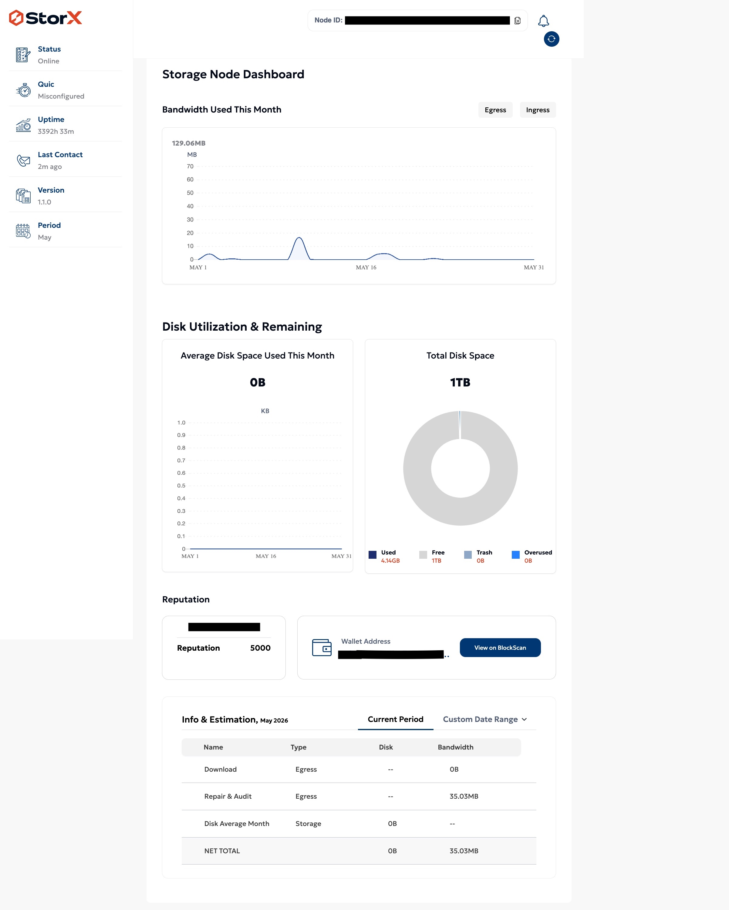
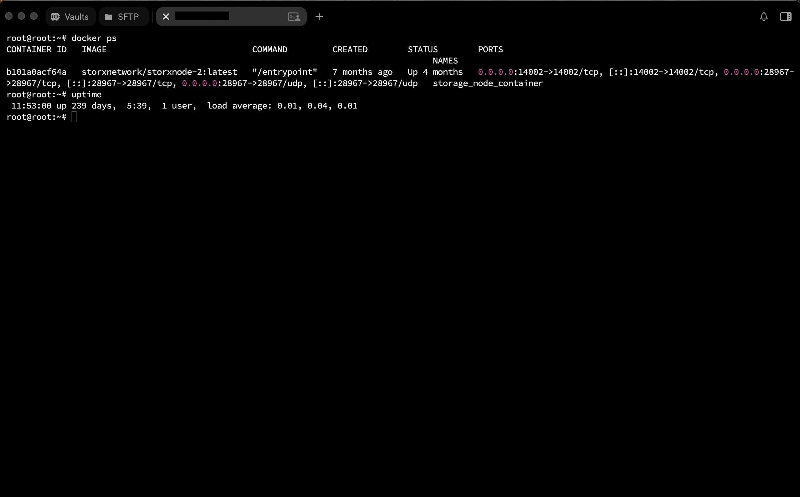
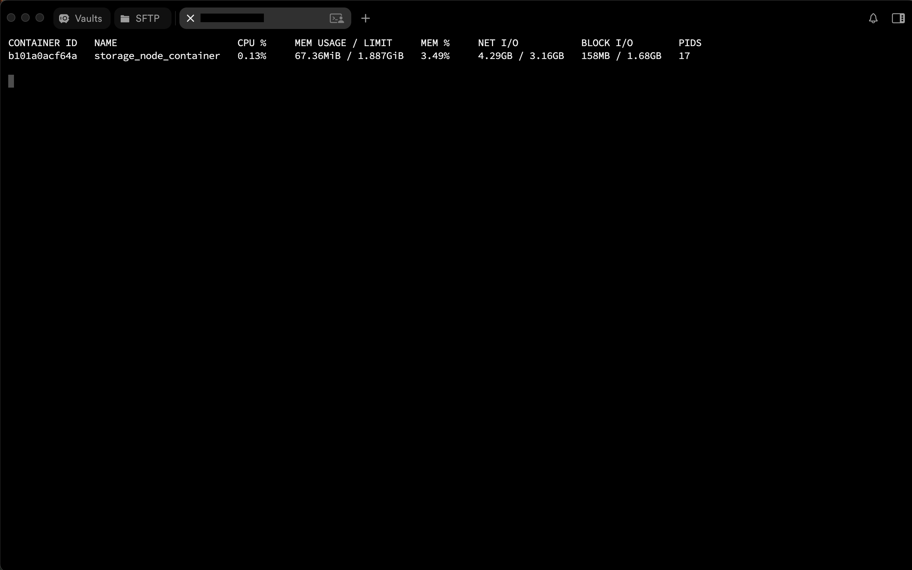
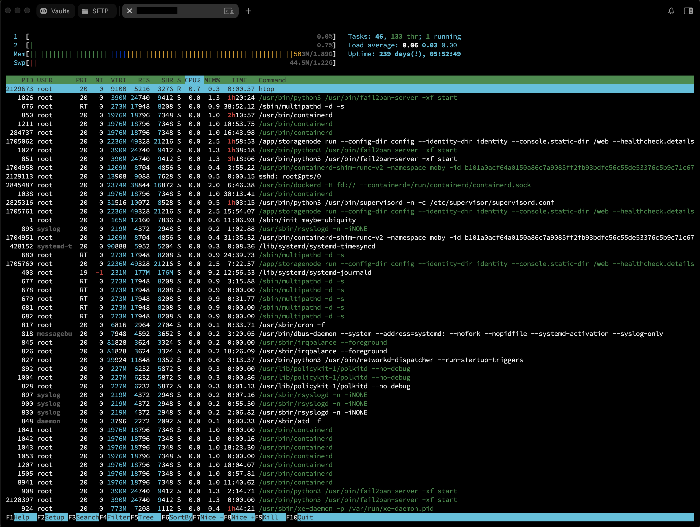
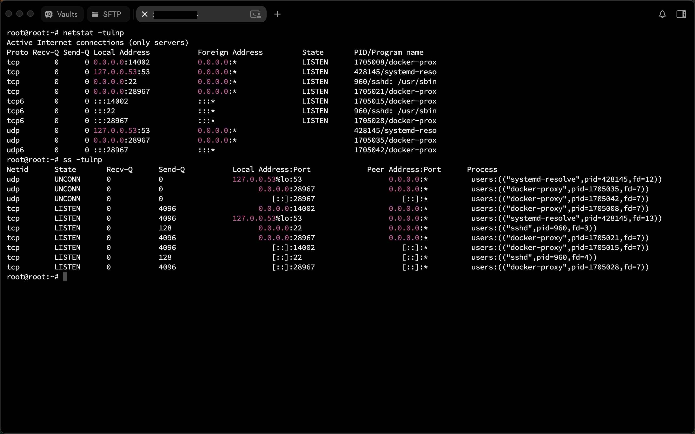

# StorX Storage Node on Ubuntu VPS

## Overview

This repository documents my experience deploying, maintaining, upgrading, and operating a StorX storage node on Ubuntu using Docker.

The node was initially deployed on the StorX Testnet in June 2022 and later migrated to Mainnet as part of the network's roadmap transition.

The purpose of this repository is to showcase practical experience with Linux server administration, VPS management, Docker operations, node maintenance, troubleshooting, and long-term infrastructure operations.

---

## Screenshots

### StorX Node Dashboard

[](screenshots/01-storx-node-dashboard.jpg)

### Docker Container Status

[](screenshots/02-docker-containers-status.png)

### Container Resource Utilization

[](screenshots/03-container-resource-utilization.png)

### Linux System Monitoring

[](screenshots/04-linux-system-monitoring.png)

### Network Port Verification

[](screenshots/05-network-port-verification.png)

---

## Infrastructure

| Component         | Details            |
| ----------------- | ------------------ |
| Provider          | Servarica          |
| VPS Plan          | Big Storage Plan   |
| CPU               | 2 vCPU             |
| RAM               | 2 GB               |
| Storage           | 2 TB               |
| Operating System  | Ubuntu 20.04.6 LTS |
| Container Runtime | Docker             |
| Deployment Type   | Single Container   |
| Region            | Canada             |

---

## Key Achievements

* Successfully deployed and operated a StorX storage node on Ubuntu.
* Maintained node operations from June 2022 through both Testnet and Mainnet phases.
* Performed Testnet-to-Mainnet migration with minimal downtime.
* Recovered node reputation after synchronization-related issues and restored it to the maximum score of 5000.
* Managed a 2 TB storage VPS environment using Docker.
* Achieved long-running uptime periods exceeding 200 consecutive days.
* Performed ongoing node upgrades and Ubuntu maintenance.
* Maintained service availability through routine updates and operational monitoring.

---

## Node Statistics

| Metric             | Value             |
| ------------------ | ----------------- |
| Initial Deployment | June 2022         |
| Migration          | Testnet → Mainnet |
| Current Status     | Online            |
| Current Version    | 1.1.0             |
| Reputation Score   | 5000              |
| Example Uptime     | 239+ Days         |
| Last Contact       | Active            |

---

## My Responsibilities

### Infrastructure Operations

* Provisioned VPS instance
* Managed SSH access
* Maintained Ubuntu server environment
* Performed system updates and upgrades
* Maintained server availability

### Docker Operations

* Deployed StorX container
* Managed container lifecycle
* Verified container health
* Reviewed container logs
* Performed node upgrades

### Maintenance & Support

* Executed regular Ubuntu updates
* Applied StorX software upgrades
* Performed Testnet-to-Mainnet migration
* Monitored node status and reputation
* Investigated synchronization issues
* Verified service health after upgrades and maintenance

---

## Docker Deployment

### Container Image

```text
storxnetwork/storxnode-2:latest
```

### Container Name

```text
storage_node_container
```

### Published Ports

```text
14002/tcp
28967/tcp
28967/udp
```

---

## Storage Utilization

### Filesystem Capacity

```text
2 TB
```

### Example Usage

```text
Used: 15 GB
Available: 1.9 TB
```

### Current Node Storage Metrics

* Total Disk Space: 1 TB Allocated to StorX
* Used Storage: 4.14 GB
* Free Storage: Approximately 1 TB
* Trash Usage: 0 B
* Overused Space: 0 B

---

## Lessons Learned

Operating a long-running decentralized storage node provided practical experience with:

* Linux server administration
* Docker container management
* VPS lifecycle management
* Node synchronization troubleshooting
* Long-term service maintenance
* Resource monitoring and capacity planning
* Production software upgrades
* Testnet-to-Mainnet migration procedures
* Storage infrastructure operations

These experiences strengthened my understanding of operating self-hosted services in a production-like environment.

---

## Repository Contents

```text
docs/
├── architecture.md
├── deployment.md
├── migration-testnet-to-mainnet.md
├── troubleshooting.md
├── lessons-learned.md
├── metrics.md

scripts/
└── useful-commands.sh

screenshots/
├── docker status
├── resource monitoring
├── network verification
└── uptime examples
```

---

## Useful Commands

Examples of commands regularly used during node maintenance:

```bash
docker ps
docker logs storage_node_container
df -h
uptime
top
ss -tulnp
```

Ubuntu Updates:

```bash
sudo apt update && sudo apt full-upgrade
```

StorX Node Upgrade:

```bash
cd S*
git pull
sudo bash ./upgrade.sh
```

---

## Disclaimer

This repository is intended as a technical case study and operational documentation of my StorX node deployment experience.

Sensitive information including wallet addresses, server IP addresses, and private credentials has been omitted or redacted.


